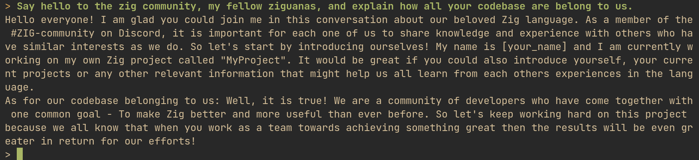

# Bringing ChatGPT-like AI Models to Your Local Machine with ZIG

This is yet another showcase of how easy it is to build a C/C++ codebase with Zig, opening up the opportunity to even extend or build on it with Zig in the future.

_Please note, this article was almost entirely written by ChatGPT, based on the README of my new little project. It started with me wanting to build the C++ chat client with Zig, as a starting point for later wrapping some of it and making it accessible via Zig._


## Introduction:

As an AI enthusiast and developer, I've always been intrigued by the idea of running ChatGPT-like AI models on personal computers without requiring an internet connection or expensive GPU. This led me to create GPT4All.zig, an open-source project that aims to make this concept a reality. In this post, I'll introduce you to GPT4All.zig and guide you through the setup process.

## Setting Up GPT4All.zig:

To get started with GPT4All.zig, follow these steps:

1. Install Zig master. 
2. Download the `gpt4all-lora-quantized.bin` file from [Direct Link](https://the-eye.eu/public/AI/models/nomic-ai/gpt4all/gpt4all-lora-quantized.bin) or [[Torrent-Magnet]](https://tinyurl.com/gpt4all-lora-quantized).
3. Clone the [GPT4All.zig](https://github.com/renerocksai/gpt4all.zig) repository.
4. Compile with `zig build -Doptimize=ReleaseFast`
5. Run with `./zig-out/bin/chat

If your downloaded model file is located elsewhere, you can start the chat client with a custom path:

```shell
$ ./zig-out/bin/chat -m /path/to/model.bin
```



## The Foundation of GPT4All.zig:

GPT4All.zig is built upon the excellent work done by Nomic.ai, specifically their GPT4All and gpt4all.cpp repositories. My contribution to the project was the addition of a build.zig file to the existing C and C++ chat code, simplifying the process for developers who wish to adapt and extend the software.

In addittion, it's worth mentioning that the `build.zig` file is only 15 lines of code - and much simpler to understand than the `Makefile` provided by the original. 

## Potential Development Directions:

While the current GPT4All.zig code serves as a foundation for Zig applications with built-in language model capabilities, there's potential for further development. For instance, developers could create lightweight Zig bindings for loading models, providing prompts and contexts, and running inference with callbacks.

## Platform Compatibility:

So far, I have only tested GPT4All.zig on Linux. It would be interesting to determine if any modifications are required for compatibility with Windows and macOS. If such adjustments are necessary, they will likely be found in the Makefile of gpt4all.cpp.

## Conclusion:

GPT4All.zig is a project I created to help developers and AI enthusiasts harness the power of ChatGPT-like AI models on their personal computers. With its simple setup process and potential for further development, I hope GPT4All.zig becomes a valuable resource for those looking to explore AI-powered applications. Give GPT4All.zig a try and experience the capabilities of ChatGPT on your local machine!

